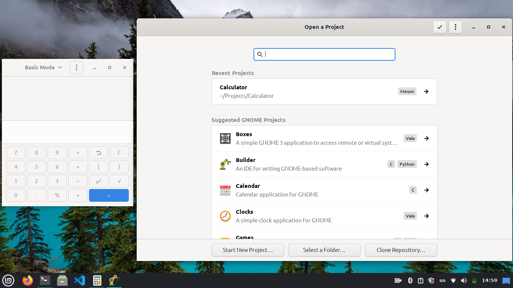
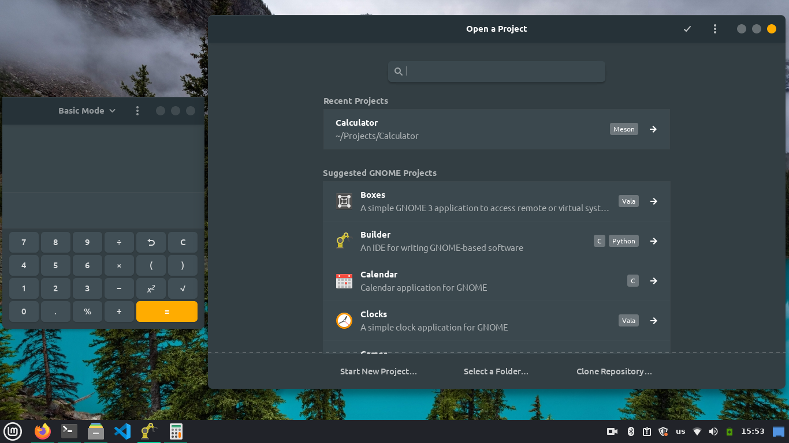

# How to apply gtk themes on flatpak apps.
Among the reasons preventing many users from installing apps using Flatpak , is that flatpak apps can not detect the currently applied gtk theme. The only official way to apply gtk themes to flatpaks is by [installing the desired theme as a flatpak](https://docs.flatpak.org/en/latest/desktop-integration.html#theming) , there are few themes available as flatpak compared with available gtk themes. In this guide I am going to introduce you a way to make flatpak apps aware of external gtk themes. 

Before we proceed , let's understand why flatpak apps have this behaviour. Flatpak apps run inside a container , so they don't have access to the host filesystem ,network ,or physical devices without setting the appropriate permession , and that is what we are going to do.

# Step 1:Give flatpak apps access to Gtk themes.
Gtk themes are located in /usr/share/themes for all users , and in ~/.themes for a specific user. To give all flatpak packages permession to access ~/.themes run the following command:
```
sudo flatpak override --filesystem=/home/user_name/.themes
```
Don't forget to replace *user_name* with your user name. Notice that you can't give access to /usr/share/themes because according to [flatpak documentaion they are black listed.](https://docs.flatpak.org/en/latest/sandbox-permissions.html#filesystem-access)
To give the above permession for a specific application (for example gnome-caluclator) use the following command:
```
sudo flatpak override org.gnome.Calculator --filesystem=/home/user_name/.themes
```

# Step 2:Tell flatpak apps which theme to use.
Giving access to ~/.themes is not enough because this directory may contain multiple themes. To tell flatpak which gtk theme to use , first copy the theme you want to apply to ~/.themes then run the following command:

```
sudo flatpak override --env=GTK_THEME=my-theme 
```
or for individual application ,run:
```
sudo flatpak override org.gnome.Calculator --env=GTK_THEME=my-theme 
```
and replace my-theme with the folder name of the theme you want to apply(and it must be located in ~/.themes).

# Step 3:Run a flatpak application.
Here is a screenshot of gnome calculator and gnome builder (flatpak version) before the above steps:

and after the above steps (With Canta gtk theme):


I hope that this guide helped you. Don't forget to write in the comments if this method worked for you (Or not) :)

# A simple problem and its solution
If you have previously overriden the GTK_THEME or filesystem for a specific flatpak package using "flatpak override" command ,that may block this package from reading the globally overriden permession. To fix this ,reset permessions of this package by running the following:
```
sudo flatpak override --reset org.example.app
```

# Additional information
Normal gtk applications load gtk theme specified by gsettings , you can run the following command to get currently applied gtk themes:
```
gsettings get org.gnome.desktop.interface gtk-theme
```
and to set the gtk theme ,run:
```
gsettings set org.gnome.desktop.interface gtk-theme my-theme
```
To do the above with flatpak , you have to enter a shell session inside the container of the desired application by running:
```
flatpak run --command=bash org.gnome.Calculator 
```
and inside this session , run the above command:
```
gsettings set org.gnome.desktop.interface gtk-theme my-theme
```
but that did not work with me , so I resorted to use GTK_THEME environment variable , which is supposed to be used for debugging purpose.
If you managed to make gsettings work , then tell me in the comments.
